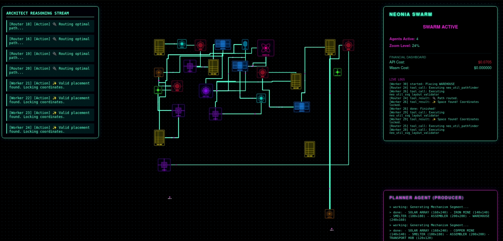

# Neonia Swarm Demo



A high-performance Rust and Tauri-based desktop application demonstrating an autonomous, multi-agent AI "Megafactory" building simulation. Powered by **Rig** (LLM Agent Framework), **MCP (Model Context Protocol)**, and **Tokio** asynchronous runtimes.

This repository serves as a live demonstration of how intelligent agents can collaboratively design, manufacture, and route complex 2D spatial layouts in real-time.

## Features

- **Asynchronous Agent Swarms:** Utilizes a highly concurrent Producer-Consumer architectural model built on `tokio`. The Producer provisions component mandates while Spatial Architect Workers consume the queue to calculate physical placements.
- **Agentic Spatial Reasoning:** Agents dynamically query the state of the factory, reading bounding-box metadata to calculate placement coordinates.
- **Deterministic Collision Healing:** Uses deterministic AABB (Axis-Aligned Bounding Box) logic paired with an organic spiral-search heuristic to heal placement overlaps instantly without excessive LLM hallucination tokens.
- **Intelligent Routing (Logistician Agents):** Agents interact with the Neonia Wasm MCP ecosystem (`neo_util_pathfinder`) to plot A* collision-free polyline routes connecting the factory blocks.
- **Live SVG Rendering:** Fully native desktop UI broadcasting Wasm-generated SVG assets directly through the Tauri backend pipeline to the frontend UI.

## Environment Variables

Create a `.env` file in the root directory (or inject these into your shell) before launching the application:

```env
# Required for connecting to the Neonia MCP Tool Gateway
# You can get a free API key by registering at https://neonia.io
NEONIA_API_KEY=your_neonia_api_key
NEONIA_MCP_URL=https://mcp.neonia.io/mcp

# Required for the LLM Spatial Reasoning and Routing Agents
OPENROUTER_API_KEY=your_openrouter_api_key
```

## How to Run

Ensure you have [Rust](https://www.rust-lang.org/tools/install) installed. You will also need the system dependencies required by Tauri.

1. **Install Rust (if you don't have it):**

```bash
curl --proto '=https' --tlsv1.2 -sSf https://sh.rustup.rs | sh
```

2. **Install required WebAssembly targets and build tools:**

```bash
cargo install tauri-cli --version "^2.0.0"
cargo install trunk
rustup target add wasm32-unknown-unknown
```

3. **Run the application in development mode:**

```bash
cargo tauri dev
```

## 🧠 Architecture Overview

The backend `src-tauri/src/lib.rs` initializes the connection to the Neonia MCP Server and spawns the Swarm:

1. **Producer Task:** Periodically provisions "sectors" (batches of SVG logic configurations like Iron Mines, Smelters, Solar Arrays) and pushes them to a globally distributed Wasm MCP queue.
2. **Consumer Polling:** The host polls the MCP queue. Upon receiving a manufacturing order, it spawns a `Spatial Architect` worker agent.
3. **Validation Loop:** The agent uses an iterative `[Reflection]` process. It calculates `(x, y)` coordinates, queries the `neo_util_svg_layout_validator` MCP tool, and iteratively adjusts its position until the server validates the spatial placement as collision-free.
4. **Logistician Routing:** A background routing task dynamically re-evaluates pathways between manufacturing nodes as the factory expands.
